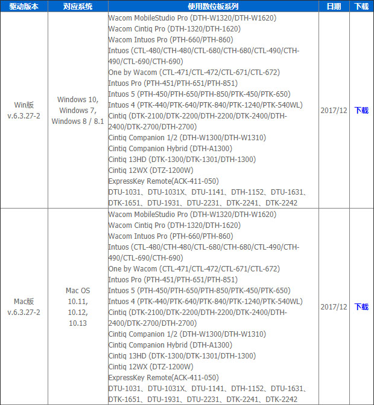
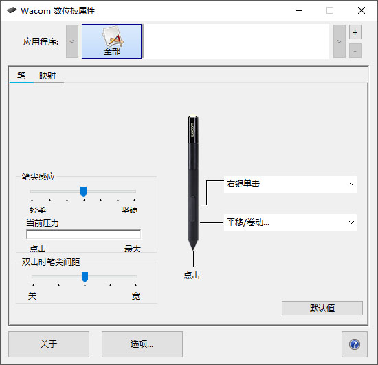
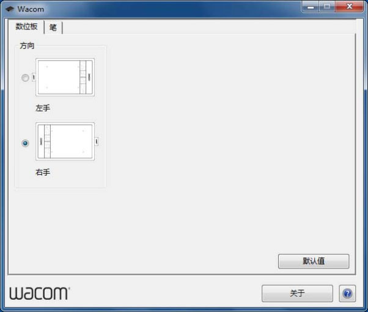
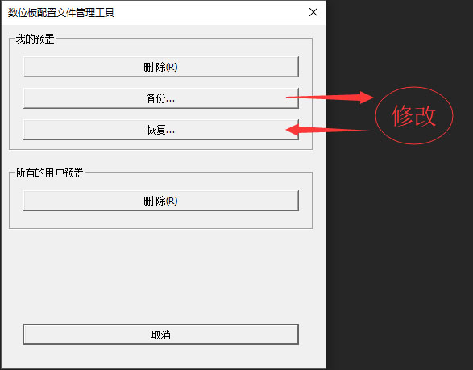
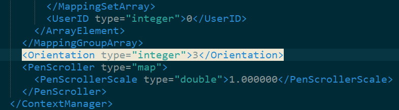
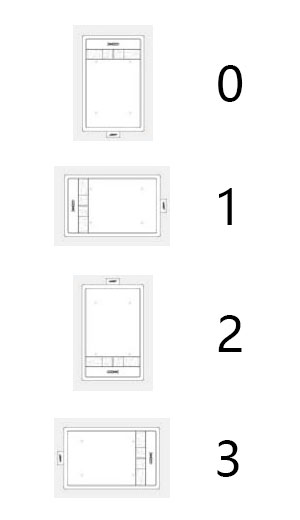

CTL-671用户，重装系统（win10）后到官网下载了最新驱动v.6.3.27-2（2017/12）

可是这个新版的驱动没有设置方向的选项，不能更换左右手，只能想办法自己解决了。

新版是这样的 ↓

旧版是这样的 ↓

谷歌百度了一番，想在官方驱动中设置是不可能了，只能靠修改配置文件解决，方法如下

首先用 Wacom数位板配置文件管理工具（开始菜单里面找） 的备份功能导出配置文件

编辑配置文件（我用notepad++）中 <Orientation type="integer">*</Orientation> 的值

这个值可以是0、1、2、3，代表数位板的四种方向

修改完配置文件后保存，再用 Wacom数位板配置文件管理工具 的恢复功能导入配置文件就OK啦！
