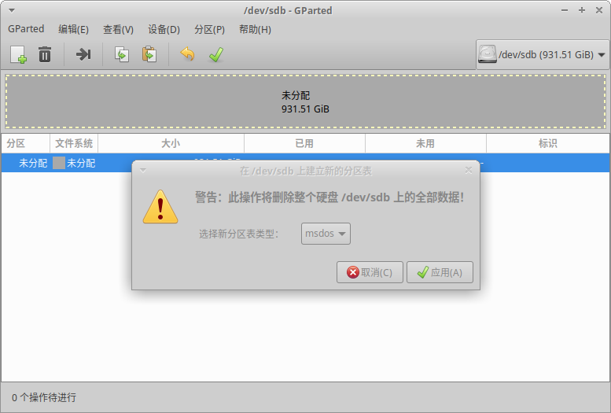
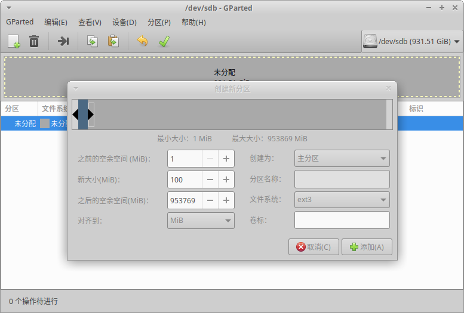
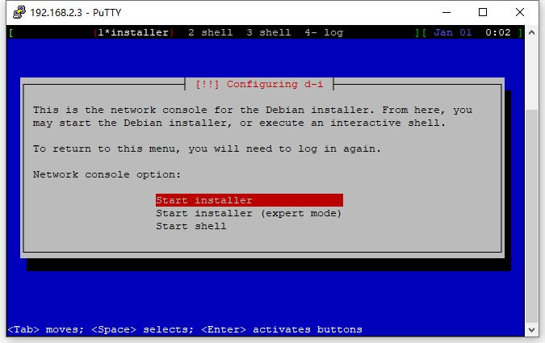
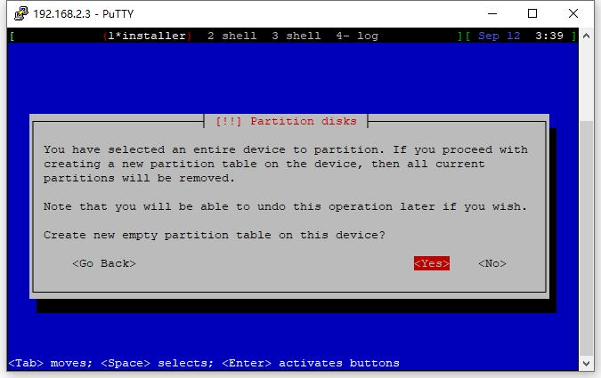
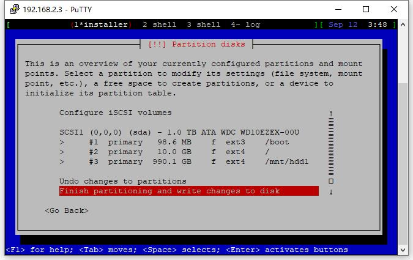

已经2020年了，居然还在折腾这个2013年的NAS。。。

一个新的在 Buffalo LS410D 上安装 Debian 的完美方法，完全不依赖原生固件。

原项目 Debian on Buffalo 兼容了几乎所有的 Buffalo NAS型号，本文只针对 LS410D 的安装流程做一个记录。

安装器的运行方式有三种：
1. 在原生固件上运行
2. 手动将文件写入硬盘
3. TFTP启动运行

我选用了第2种，使用一块空白的硬盘进行安装。

> 原项目地址: https://github.com/1000001101000/Debian_on_Buffalo

## 1.准备工作

需要准备以下东西
* 一台运行linux的电脑，接上NAS的硬盘
* 下载两个安装器文件，initrd.buffalo 和 uImage.buffalo（下载地址：https://github.com/1000001101000/Debian_on_Buffalo/tree/master/Buster/installer_images/armhf_devices），下载完修改相应的文件名



对硬盘进行分区，分区表 MBR 或者 GPT 都可以



建一个分区用于存放安装器

这个分区必须是磁盘上的第一个分区，格式为 EXT2 或者 EXT3，最好使用EXT3

分区大小原文说1GB差不多，但是我试了100MB也是可以的

分区建好以后挂载上，然后把前面下载的两个安装器文件复制到这个分区上

准备工作完毕，可以把硬盘卸下装回 LS410D 了

## 2.安装过程

LS410D通电启动，正常启动（白灯常亮）后等一会儿就可以通过 SSH 连接了

SSH 的用户名为 installer，密码为 install



登陆成功后就能看到安装器了，接下来就是一步一步安装 Debian 了，流程和平时安装 Debian 基本一致

其他步骤就不多做介绍，主要是磁盘分区这一步有几个注意点

之前准备工作建立的存放安装器的分区此时已经启动起来，后续用处不大，所以此时可以直接把整个磁盘重新分区

可以简单粗暴一些，直接重建分区表



注意点
* /boot 必须是磁盘上的第一个分区，且必须格式化为 EXT3 格式
* /boot 大小没有什么限制，我设置为100MB差不多正好，安装完实际容量60+MB
* / 根目录大小随意，可以格式化为 EXT4



我的磁盘分区如上图，主要是 /boot 挂载点需要多注意一下

## 3.系统调整

对风扇、按钮、和LED做一些设置

**风扇**

风扇使用PWN调速，安装 fancontrol

```sh
apt-get install fancontrol
```

然后 pwmconfig 设置好温度对应的转速就OK了。

**按钮**

按钮为GPIO按钮，安装 triggerhappy

```sh
apt-get install triggerhappy
```

监听按钮命令

```sh
thd --dump /dev/input/event*
```

然后按 LS410D 上的按钮就可以知道各个按钮的名称了

后面的电源开关为 KEY_ESC，1为ON，0为OFF

前面板按钮为 KEY_OPTION，按下时为1，弹起时为0

给电源开关添加关机功能

```sh
vi /etc/triggerhappy/triggers.d/ls410d.conf
 + KEY_ESC    0    poweroff
```

先启用一下rc.local，不习惯systemd

```sh
cat > /etc/rc.local <<EOF
#!/bin/sh
exit 0
EOF

chmod +x /etc/rc.local
systemctl enable rc-local
systemctl start rc-local
```

设置自启动

```sh
vi /etc/rc.local
 + thd --daemon /dev/input/event0 --triggers /etc/triggerhappy/triggers.d/ls410d.conf
```

**LED**

四个控制LED亮度的文件：

* led:function:white/brightness
* led:power:white/brightness
* led:power:orange/brightness
* led:power:red/brightness

四个控制LED行为的文件：

* led:function:white/trigger
* led:power:white/trigger
* led:power:orange/trigger
* led:power:red/trigger

LED可以用来指示硬盘、网络等状态，默认 led:function:white 用来指示硬盘活动

关闭电源指示灯

```sh
echo 0 > /sys/class/leds/led\:power\:white/brightness
```
