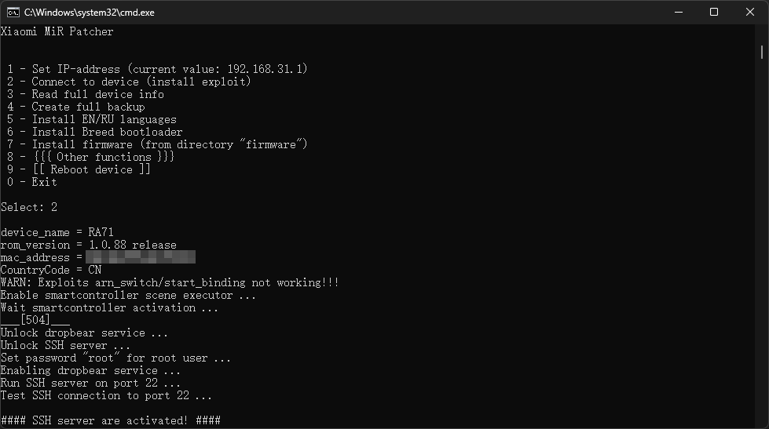

此方法保留原厂U-Boot，刷完以后也可以用小米路由器修复工具恢复到原厂固件。
刷breed/pb-boot也有好处，但是感觉没啥必要。

## 1.更换原厂固件

CR6609的1.0.41固件打开SSH失败，AX1800的1.0.88固件打开SSH成功，所以先把CR6609刷成AX1800。
小米路由器修复工具从官网下载 *https://bigota.miwifi.com/xiaoqiang/tools/MIWIFIRepairTool.x86.zip*
AX1800的固件是在恩山论坛找的 *https://www.right.com.cn/forum/thread-6733732-1-1.html*
运行小米路由器修复工具，按软件提示进行刷机即可。


刷完配置一下路由器管理密码，下一步要用到。

## 2.打开SSH

网上开SSH的方法有很多，这个方法应该是最方便的，不用拆机、不用另外一台路由器辅助、也不用虚拟机。
项目地址 *https://github.com/openwrt-xiaomi/xmir-patcher*
下载下来之后按说明安装依赖并运行即可。



## 3.刷OpenWrt

下载OpenWrt固件，选择FIRMWARE类型的 *https://firmware-selector.openwrt.org/*
下载好的固件传到路由器的tmp文件夹，用WinSCP连接时协议选SCP，SFTP是不支持的。
SSH连接路由器开始刷入OpenWrt，命令如下

```sh
nvram set boot_wait=on
nvram set bootdelay=3
nvram set flag_try_sys1_failed=0
nvram set flag_try_sys2_failed=1
nvram commit
mtd -e firmware -r write /tmp/openwrt-24.10.0-ramips-mt7621-xiaomi_mi-router-cr6609-squashfs-firmware.bin firmware
```

以上命令参考 *https://www.lotlab.org/2022/11/11/guide-to-flash-openwrt-to-xiaomi-cr660x/*
刷入后路由器会自动重启
