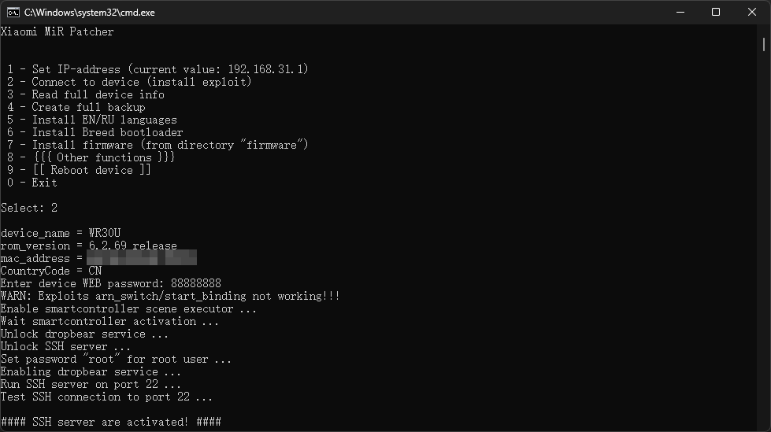
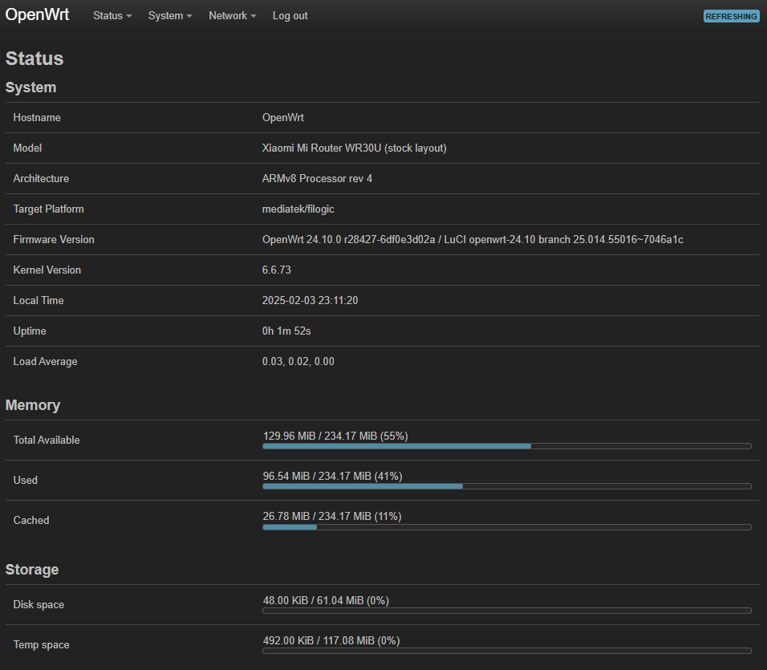

为WR30U刷入stock layout（原厂U-Boot）的Openwrt
参考 *https://github.com/openwrt/openwrt/pull/12770*
原文中也有刷Openwrt U-Boot layout的方法

## 1.打开SSH

开SSH的方法有很多，这个方法应该是最方便的。
项目地址 *https://github.com/openwrt-xiaomi/xmir-patcher*
下载下来之后按说明安装依赖并运行即可。



## 2.备份原厂固件的几个重要分区

```sh
nanddump -f /tmp/BL2.bin /dev/mtd1
nanddump -f /tmp/Nvram.bin /dev/mtd2
nanddump -f /tmp/Bdata.bin /dev/mtd3
nanddump -f /tmp/Factory.bin /dev/mtd4
nanddump -f /tmp/FIP.bin /dev/mtd5
nanddump -f /tmp/ubi.bin /dev/mtd8
nanddump -f /tmp/KF.bin /dev/mtd12
```

stock layout（原厂U-Boot）和 Openwrt U-Boot layout 都不支持NMBM，也就是闪存坏快管理，请妥善保管好备份文件。

## 3.设置Nvram

WR30U的固件是双槽位的，不同的槽位要执行不同的命令
执行下面这条命令

```sh
cat /proc/cmdline
```

根据结果执行相应的命令

### 3.1.结果是firmware=0或者mtd=ubi

```sh
nvram set boot_wait=on
nvram set uart_en=1
nvram set flag_boot_rootfs=1
nvram set flag_last_success=1
nvram set flag_boot_success=1
nvram set flag_try_sys1_failed=0
nvram set flag_try_sys2_failed=0
nvram commit
```

### 3.2.结果是firmware=1或者mtd=ubi1

```sh
nvram set boot_wait=on
nvram set uart_en=1
nvram set flag_boot_rootfs=0
nvram set flag_last_success=0
nvram set flag_boot_success=1
nvram set flag_try_sys1_failed=0
nvram set flag_try_sys2_failed=0
nvram commit
```

## 4.刷入initramfs-factory类型的OpenWrt固件

和步骤3一样，不同的槽位要执行不同的命令

### 4.1.结果是firmware=0或者mtd=ubi

```sh
ubiformat /dev/mtd9 -y -f /tmp/*-stock-initramfs-factory.ubi
```

### 4.2.结果是firmware=1或者mtd=ubi1

```sh
ubiformat /dev/mtd8 -y -f /tmp/*-stock-initramfs-factory.ubi
```

然后重启路由器就会进入initramfs模式的OpenWrt

## 5.设置uboot-env

这一步在后面的升级步骤中会自动执行，可以忽略，不过手动执行一下也没啥坏处。

如果`fw_setenv`命令无效，就需要执行以下下面这条命令

```sh
echo "/dev/mtd1 0x0 0x10000 0x20000" > /etc/fw_env.config
```

然后设置uboot-env，命令如下

```sh
fw_setenv boot_wait on
fw_setenv uart_en 1
fw_setenv flag_boot_rootfs 0
fw_setenv flag_last_success 1
fw_setenv flag_boot_success 1
fw_setenv flag_try_sys1_failed 8
fw_setenv flag_try_sys2_failed 8
fw_setenv mtdparts "nmbm0:1024k(bl2),256k(Nvram),256k(Bdata),2048k(factory),2048k(fip),256k(crash),256k(crash_log),34816k(ubi),34816k(ubi1),32768k(overlay),12288k(data),256k(KF)"
```

## 6.刷入sysupgrade类型的OpenWrt固件

使用下面的命令

```sh
sysupgrade -n /tmp/*-stock-squashfs-sysupgrade.bin
```

或者在web管理页面操作也行。



## 7.刷回原厂固件

```sh
ubiformat /dev/mtd8 -y -f /tmp/ubi.bin
```
